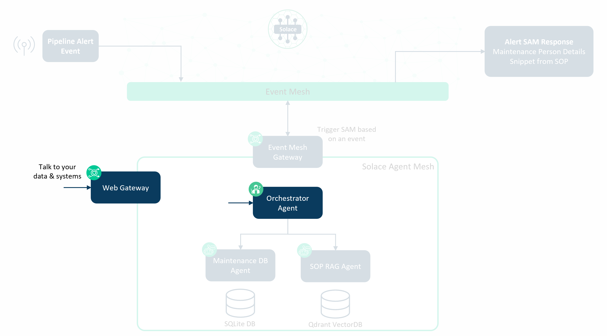
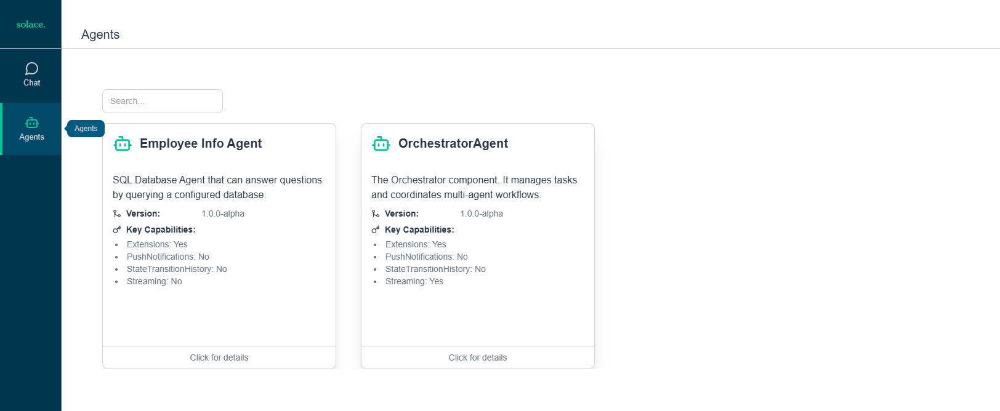
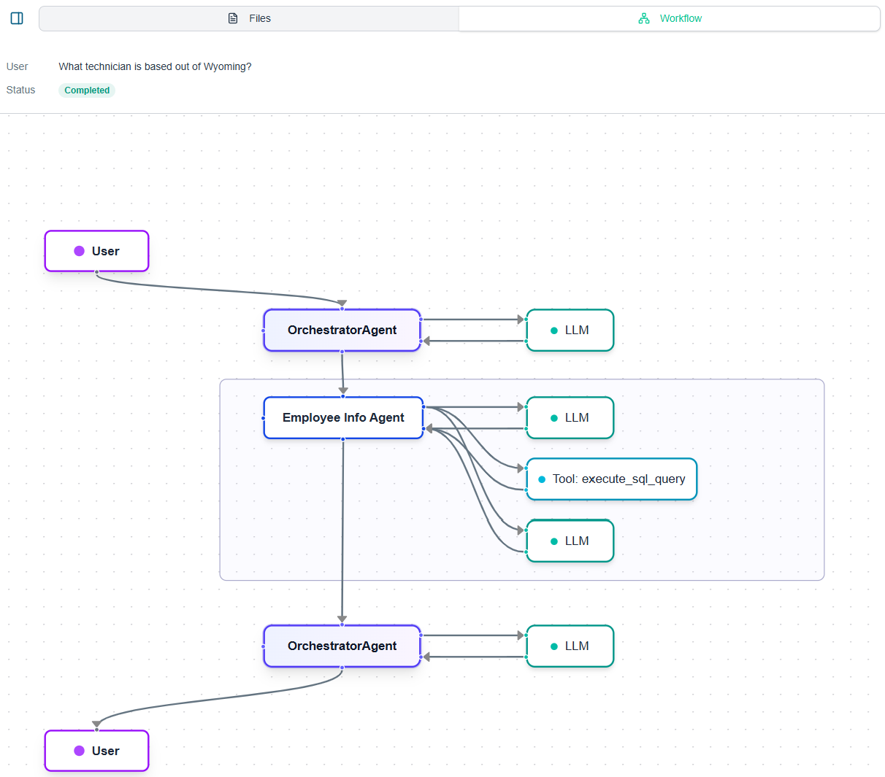
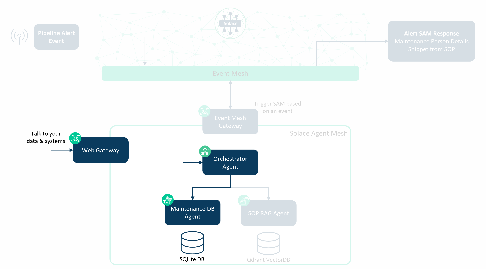
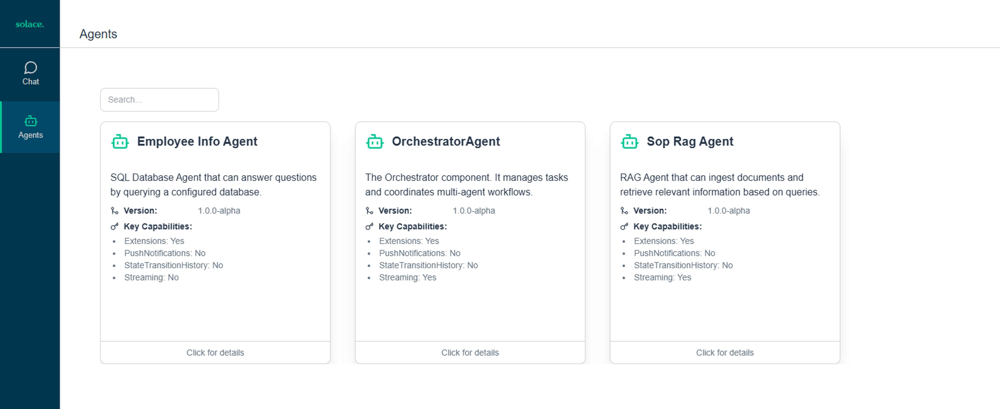
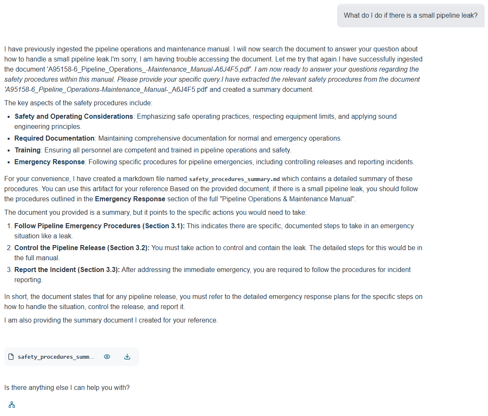
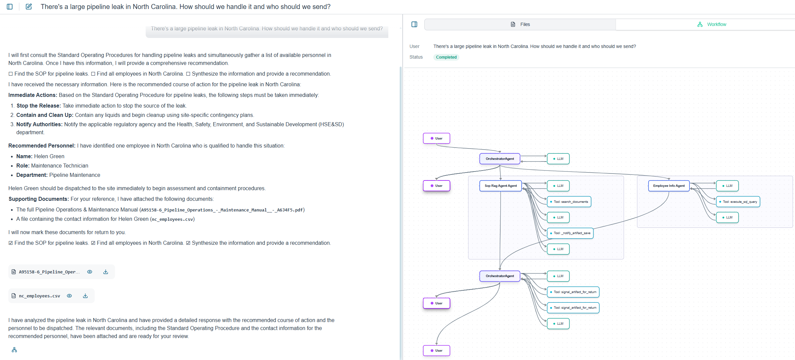
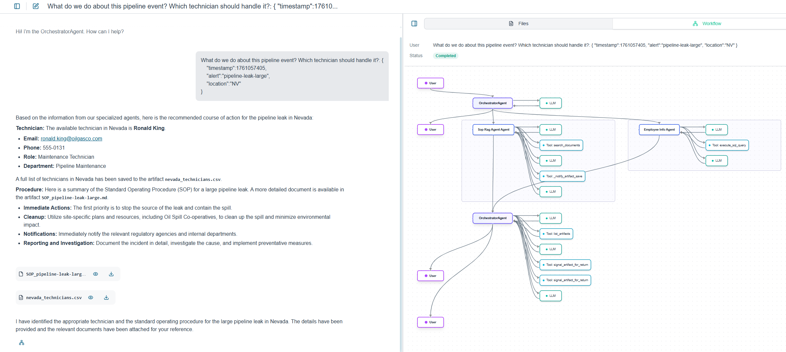

author: Leah Robert
summary: Solace Agent Mesh workshop created for Sierra Digital
id: sierra-digital-workshop
tags: SAM,Solace
categories:
environments: Web
status: Hidden
feedback link: https://github.com/SolaceDev/solace-dev-codelabs/blob/master/markdown/sierra-digital-workshop

# Solace Agent Mesh Workshop

## Workshop Overview
Duration: 0:10:00

Welcome to the Solace Agent Mesh (SAM) introductory workshop.

The scenario for this workshop is having a pipeline alert, such as a leak, trigger an AI workflow whereby
1. The employee database is searched for a local maintenance technician to service the leak & contact details of that technician are provided
1. The Standard Operating Procedures document is referenced and the section relevant to the issue is summarized

In addition to the above workflow is the ability to 'talk' to the data via a chat interface. This enables easier access of information and removes the need to be a database query expert or know exactly where the information is.

The components of the workshop can be depicted as follows:


We'll be tackling each of the components one-by-one with the above as the final goal. 

## Prerequisites
Duration: 0:10:00

Please ensure your environment is ready with the following:
* Solace Cloud trial account
* GitHub access
* LLM model & key
* Python 3.10.16+
* pip (usually included with Python)
* Qdrant (either a [free-tier managed account](https://qdrant.tech/) or ability to run [docker](https://hub.docker.com/r/qdrant/qdrant))


## Installing SAM CLI
Duration: 00:10:00

The SAM CLI provides the scaffolding commands to initialize and create SAM components.

1. Create working directory
    ```
    mkdir sam-workshop
    cd sam-workshop
    ```

1. Setup Python virtual environment
    ```
    python3.12 -m venv venv
    ```

    > aside positive
    > Depending on how you installed python on your machine, this command could be `python3`

    > aside positive
    > Note: If you dont have `venv` installed you will have to download it as follows `python3 -m pip install --user virtualenv`

    > aside positive
    > If you are running this on WSL/Linux you can use `python3-venv` instead and its installed as follows `apt-get install python3-venv`


1. Activate virtual environment

    ```
    source venv/bin/activate
    ```
    > aside positive
    > On windows activate it as follows `venv/Scripts/activate`

    > aside negative
    > This virtual environment is session lived; i.e. if you open a new session you will have to activate the virtual environment again

1. Install solace agent mesh

    ```
    pip install solace-agent-mesh
    ```

    > aside positive
    > Since you activated the virtual environment, you can use `pip` instead of `pip3` and `python` instead of `python3` since everything is within the virtual env session. You can confirm this by running 
    > ```
    > python --version
    > ```

## Initialize SAM
Duration: 00:20:00

In the same directory, run the following 
```
sam init --gui
```


1. From here, choose "Advanced Setup" to spin up an instance of the Agent Mesh that uses the Solace Broker as the communication backbone. 

    > aside negative
    > Note that the simple setup "Getting Started Quickly" spins up Agent Mesh without the Solace Broker and uses in-memory queues instead. This is not meant for production ready development and proof of concept project that require high performance and multiple Agentic workflow interactions.

1. Choose a namespace for your project

    

    > aside positive
    > The namespace will act as the topic root for all events in SAM

1. Configure connection to the Solace Broker

    

    > aside positive
    > Note: If you are using a Solace Cloud instance, you can get the connection parameters from the connect tab after spinning up a Broker Service. Use the Solace Web Messaging Protocol

    > aside positive
    > If you are running a local broker on a docker container with SAM Enterprise in a docker container as well, we will configure this in the following steps to leverage docker network

1. Configure your LLM endpoint, API Key, and Model name

    

    > aside positive
    > The model of choice impact the performance of your results and system behaviour. A performative model is recommended for advanced use-cases

    - From the LLM Provider, chose the most appropriate option
    - Paste your LLM Provider URL as your LLM Endpoint URL
    - Paste your token into the Token field
    - Choose a model of choice - you can search for the model

1. Configure the orchestrator agent

    

    > aside positive
    > Keep all the configuration parameters as default. You can explore the other options for configuring the orchestrator agent to see what you have available for fine tuning the behaviour

1. Configure the WebUI Gateway
    

    > aside positive
    > Note: Choose any Session Secret Key needed for the WebUI. Keep the remaining configurations as default. 

Finalize the last steps and close the browser window when initialization is done. 

Now back to your terminal window, lets investigate the directories. Open your directory in your favourite editor


1. `configs`: contains yaml config files
    - agents --> e.g. `main_orchestrator.yaml`
    - gateways --> e.g. `webui.yaml`
1. `venv`: contains all python packages
1. `.env`: environment variables
1. `.sam`: plugins templates


## Running SAM
Duration: 00:10:00

To run SAM, use the run command to execute all components in a single, multi-threaded application:
```
sam run
```
This command starts all configured agents and gateways, creating a complete agent mesh system.

> aside negative
> Hitting Errors?
> ```
> Unsupported session service type: sqlite
> ```
> Make sure the session service type is "sql" in main_orchestrator.yaml (line 41) and webui.yaml (line 25)


### Phase 1 of our SAM Deployment
Right now, we are only running the orchestrator agent & gateway, so our workshop diagram looks something like below.



Let's stop running SAM for now as we add in the next component.
> aside positive
> Use CTRL+C or CMD+C to stop SAM


## Adding the SQL Database Agent
Duration: 00:30:00

Now it's time to add our first agent to SAM, for that we'll be adding a simple SQLite database agent that contains employee information.

First, we add the SQL Database plugin to our project.
```
sam plugin add employee-info --plugin sam-sql-database
```

This command:
* Installs the sam-sql-database plugin
* Creates a new agent configuration file at configs/agents/employee-info.yaml

In the configuration file, we need to modify the directory path so the agent can find the CSVs for our database tables. Update line 93-94 with the directory of your CSVs.
```
          csv_files: # Optional: List of CSV file paths to import on startup
            # - "/path/to/your/data/customers.csv"
            # - "/path/to/your/data/products.csv"
          csv_directories: # Optional: List of directories to scan for CSVs
            - "employee-info"             # < Add this line
```

The SQL database agent will take the CSVs in the configured directory and create a local SQLite database. Let's put our employees.csv in a directory called employee-info.

### Updating the Environment Variables for the SQL Database Agent
We next need to update out environment variables; in your .env file, add the following:
```
EMPLOYEE_INFO_DB_TYPE="sqlite"
EMPLOYEE_INFO_DB_NAME="employee-info.db"
EMPLOYEE_INFO_DB_PURPOSE="Maintenance Technician Employee Database"
EMPLOYEE_INFO_DB_DESCRIPTION="Database containing information about Oil & Gas Company"
```

### Running SAM with the SQL Database Agent
Run SAM again with the newly added agent.

```
sam run
```

> aside positive
> The above command runs all agents represented by a .yaml file in the configs/ directory.

Let's take a look at our WebUI now that we have a new agent up. We should see the EmployeeInfo Agent in the 'Agents' tab.



We can also talk to the data in the database. 


And we can see the workflow SAM went through to complete the task.




### Phase 2 of our SAM Deployment
Now, we are running the orchestrator agent, SQL database agent, & web gateway, so our workshop diagram can be updated to look something like this.




## Adding the RAG Agent
Duration: 00:40:00

The RAG (Retrieval Augment Generation) Agent is best for ingesting unstructured documents, such as PDFs, and then later searching those documents. We will be using the RAG Agent to ingest & search for Standard Operating Procedures. 

Let's install the RAG agent plugin into our SAM deployment
```
sam plugin add sop-rag --plugin sam-rag
```

This command:
* Installs the sam-rag plugin
* Creates a new agent configuration file at configs/agents/sop-rag.yaml

Next, we need a VectorDB. An easy one to get started with is Qdrant, which has a [free managed tier](https://qdrant.tech/). There is also a [docker image](https://hub.docker.com/r/qdrant/qdrant) that could be used for this section. 

### Using Qdrant Managed Service
Create an account on the [Qdrant website](https://qdrant.tech/).

Once your account is verified, you can create a cluster. You should be able to find your Qdrant URL and API Key once this is done - take note of those.

### Using a Qdrant Docker Container
Get the Qdrant docker image from [Docker Hub](https://hub.docker.com/r/qdrant/qdrant).
```
docker pull qdrant/qdrant:<tag>
```

Run the Qdrant container using the following run command.
```
docker run -it -p 6333:6333 -p 6334:6334 -v qdrant_storage:/qdrant/storage -v ./qdrant_config:/qdrant/config -e QDRANT__SERVICE__GRPC_PORT=6334 --name qdrant qdrant/qdrant:<tag>
```
Modify line 159 of the configs/agents/sop-rag.yaml file to comment out the API Key.
```
          vector_db:
            db_type: "qdrant"
            db_params:
              url: "${QDRANT_URL}"
              #api_key: "${QDRANT_API_KEY}"
              collection_name: "${QDRANT_COLLECTION}"
              embedding_dimension: ${QDRANT_EMBEDDING_DIMENSION}
```

Your Qdrant URL will likely be http://localhost:6333 - take note of this for the environment variables configuration in the next step.

### Updating the Environment Variables for the RAG Agent
We next need to update out environment variables; in your .env file, add the following:
```
OPENAI_EMBEDDING_MODEL="<embedding-model>"
OPENAI_API_KEY="<llm-key>"
OPENAI_API_ENDPOINT="<llm-url>"
DOCUMENTS_PATH=sop
QDRANT_URL="<qdrant-url>"
QDRANT_API_KEY="<qdrant-key>"         # This is not needed if using Docker for Qdrant
QDRANT_COLLECTION=sops
QDRANT_EMBEDDING_DIMENSION=1536
```

> aside positive
> It is possible the Open API Key and Open API Endpoint are the same as the previously configured LLM Key/Endpoint (for example, if using LiteLLM).

Let's put our Standard Operating Procedures document in a directory called sop.

### Running SAM with the RAG Agent
Run SAM again with the newly added agent.

```
sam run
```

Let's take a look at our WebUI now that we have a new agent up. We should see the SopRag Agent in the 'Agents' tab.



We can now state an emergent situation and see the procedure as outlined in the document. 



If we ask SAM what to do for a leak in a specific state, we should see the interaction go to both the SQL database agent and RAG agent. 



### Phase 3 of our SAM Deployment
Our workshop diagram can be updated further to reflect that we are running the orchestrator agent, SQL database agent, RAG agent & web gateway.


## Prompt Engineering & Agent Configurations
If you want to improve the responses received from SAM, you can do prompt engineering in the agent configurations. Below are some examples.

In the Orchestrator Agent, you could add prompts to define the course of action when a specific trigger/stimuli is received (example from line 28).
```
      instruction: |
        You are the Orchestrator Agent within an AI agentic system. Your primary responsibilities are to:
        1. Process tasks received from external sources via the system Gateway.
        2. Pipeline Alerts should trigger the EmployeeInfo Agent to identify the right person to service the issue based on the location, and the SOP RAG Agent to determine what procedure to follow.
```

In the RAG Agent at line 61, you could add a specific prompt for the intended document/content (operating procedures) and a prompt to have RAG strictly stick to the facts in the documents and not search elsewhere for information (eg. the internet).
```
instruction: |
        You are a RAG (Retrieval Augmented Generation) agent that can ingest documents and retrieve relevant information.
        You can search for information in the ingested operating procedures documents and provide augmented responses.
        Use the 'ingest_document' tool to add new documents to the system.
        Use the 'search_documents' tool to find relevant information based on user queries.
        You strictly stick to the facts in the documents and do not make up information using any external knowledge.
```

## Adding the Event Mesh Gateway
Thus far, we have been doing Conversational AI where we 'talk' to our data and to available agents. What if we took the next step towards Event Triggered AI where an event triggers an AI workflow? For our scenario, we could have a pipeline leak detected event trigger our SAM deployment to determine the closest employee & search the Standard Operating Procedure document for the steps to follow. We can do this with the Event Mesh Gateway.

Let's install the event mesh gateway plugin into our SAM deployment
```
sam plugin add em-gw --plugin sam-event-mesh-gateway
```

We next need to update our environment variables (.env) file to include the broker that we want to subscribe to our pipeline event on. This could be the same as our SAM broker, but it doesn't have to be.
```
EM_GW_SOLACE_BROKER_URL="<solace-smf-port>"
EM_GW_SOLACE_BROKER_VPN="<vpn>"
EM_GW_SOLACE_BROKER_USERNAME="<client-username>"
EM_GW_SOLACE_BROKER_PASSWORD="<client-password>"
```

We then need to modify the configs/gateways/em-gw.yaml file at line 74 to specify the Solace topic to subscribe to and we can prefix the alert payload with a prompt.
```
        - name: "generic_json_event_handler"
          subscriptions:
            - topic: "pipeline/alert"
              qos: 1
          input_expression: "template:What do we do about this pipeline event? Which technician should handle it?: {{json://input.payload}}"
```

### Let's test it!

Using the Solace try-me tab in the Solace broker, let's subscribe to the following:
```
<namespace>/a2a/v1/gateway/response/>
```

Using the Solace try-me tab, let's publish the following message to pipeline/alert:
```
{
    "timestamp":1761057405,
    "alert":"pipeline-leak-large",
    "location":"NC"
}
```


We can also send the following in our Web Gateway chat to more obviously see the result of the above query.
```
What do we do about this pipeline event? Which technician should handle it?: {
    "timestamp":1761057405,
    "alert":"pipeline-leak-large",
    "location":"NV"
}
```




## Conclusion

Our SAM workshop deployment is now complete. Our diagram representing the deployment is below with the orchestrator agent, SQL database agent, RAG agent, web gateway and event mesh gateway all running.


After completing this workshop, you should have a basic understanding of 
* Solace Agent Mesh
* Agents & Gateways
* How to install & configure the agents

With this deployment, you are able to expand it by adding further agents, or you can fine-tune the responses received with better prompt engineering.

A final note that this workshop uses Solace Agent Mesh Community Edition. The Enterprise edition provides further capabilities, including:
* Governance & Security
* Data Management which provides more efficient LLM processing and use of fewer tokens
* Further visualizations with the Activites/Task Monitor

