author: Tamimi A
summary:
id: solace-agent-mesh
tags: 
categories: Solace, Agent Mesh, AI
environments: Web
status: Published 
feedback link: https://github.com/SolaceDev/solace-dev-codelabs/blob/master/markdown/solace-agent-mesh

# Getting started with Solace Agent Mesh - An Agent Orchestration Framework

## What you'll learn: Overview
Duration: 0:02:00

In this codelab, you'll gain a foundational understanding of the [Solace Agent Mesh](https://solacelabs.github.io/solace-agent-mesh/docs/documentation/getting-started/introduction/). You'll explore the architecture, key components, and benefits of the Solace Agent Mesh, learning how it enables scalable, event-driven communication between AI agents and services. The introduction covers the evolution of event-driven architectures and highlights real-world use cases where agent mesh technology can be applied.

By the end of this codelab, you'll be equipped to get started with Solace Agent Mesh, including learning the building blocks, installation prerequisites, running built-in agents, and connecting different types of agents. You'll understand how to develop custom agents, leverage plugins and tools, and build multi-agent systems that harness the power of event mesh and standardized protocols for robust, collaborative AI solutions.


## Introduction to the Solace Agent Mesh
Duration: 0:07:00

### Problem statement
Building effective agentic systems presents a complex challenge that extends far beyond simply deploying AI models. AI Agents are siloed systems that operate in isolation, and are unable to effectively communicate or share capabilities across organizational boundaries. **By definition and design, Agents are inherently domain-specific, designed to excel in narrow use cases but struggling to collaborate or leverage expertise from other specialized agents, creating fragmented AI ecosystems that fail to realize their collective potential.**


To make intelligent decisions and respond to dynamic conditions, agentic systems must rely on event-driven actions that flow into the organization. While solving the core AI challenge represents only 20% of the effort, the remaining 80% involves the much more complex task of connecting AI models to the disparate data sources, legacy systems, APIs, and organizational knowledge that exist across isolated silos—making data accessibility and integration the true bottleneck in delivering practical AI value

> aside negative
> Without a framework like Solace Agent Mesh, connecting AI systems to siloed data sources can be extremely complex, requiring custom integration code and pointing to point connections resulting in maintenance challenges.

### What is Solace Agent Mesh?

Solace Agent Mesh is a comprehensive open-source framework that empowers developers to build sophisticated, distributed AI systems. On a high level, Agent mesh provides developers with the following:

1. **Core Communication & Protocol**

   - **Standardized [A2A](https://a2a-protocol.org/dev/specification/) (Agent-to-Agent) Protocol**: A unified communication standard that enables seamless interaction between AI agents, regardless of their underlying implementation or deployment location
   - **Event-Driven Architecture**: Built on the Solace Event Broker for asynchronous, scalable, and resilient agent communication
   - **Topic-Based Routing**: Intelligent message routing that enables agents to discover and communicate with each other dynamically

2. **Data Integration & Connectivity**

   - **Real-World Data Source Integration**: Access to real-time data and integrations from the event mesh allows AI agents access to different business events
   - **Universal Gateway Support**: Multiple interface types including REST APIs, WebSockets, webhooks, and direct event mesh integration
   - **Streaming Data Processing**: Real-time event processing capabilities for handling live data streams and IoT sensor feeds
   - **Multi-Protocol Support**: Connect to systems using HTTP, MQTT, AMQP, WebSocket, and custom protocols

3. **Workflow Orchestration & Management**

   - **Complex Workflow Orchestration**: Coordinate sophisticated multi-agent workflows with dependency management and parallel execution
   - **Task Decomposition**: Automatically break down complex requests into manageable subtasks for specialized agents
   - **Result Aggregation**: Intelligent collection and synthesis of results from multiple agents into cohesive responses

4. **Extensibility & Plugin Architecture**

   - **Modular Plugin System**: Easily extend functionality through a rich ecosystem of [community](https://github.com/solacecommunity/solace-agent-mesh-plugins) and [commercial plugins](https://github.com/SolaceLabs/solace-agent-mesh-core-plugins)
   - **Custom Agent Development**: Comprehensive tools and templates for building domain-specific agents with specialized capabilities
   - **Gateway Plugins**: Create custom external interfaces for unique integration requirements with the Gateway Development Kit (GDK)
   - **Service Provider Plugins**: Standardized abstractions for integrating with backend systems and data sources
   - **Tool Framework**: Extensible tool system that allows agents to perform actions and interact with external services

5. **AI Model & Provider Support**

   - **Multi-Model Compatibility**: Support for all major AI providers including OpenAI, Anthropic, Google, Azure OpenAI, and local models
   - **Model Abstraction**: Switch between different AI models without changing agent logic
   - **Custom Model Integration**: Support for proprietary and fine-tuned models through flexible provider interfaces

6. **Development Tools & Framework**

   - **Comprehensive CLI**: Full-featured command-line interface for project creation, management, and deployment
   - **Configuration Management**: YAML-based configuration system with environment variable support and validation

7. **Security & Enterprise Features**

   - **Multi-Authentication Support**: JWT, OAuth, API keys, and custom authentication mechanisms
   - **Role-Based Access Control**: Fine-grained permissions and authorization for agents and resources
   - **Identity Service Integration**: Integration with enterprise identity providers and HR systems


8. **Scalability & Performance**

   - **Horizontal Scaling**: Easily scale individual agents or entire agent meshes based on demand
   - **Resource Management**: Intelligent resource allocation and optimization for optimal performance
   - **Async Processing**: Non-blocking, asynchronous operations for maximum throughput
   - **Shock Absorbing**: Built on top of an advanced message broker, Solace Event Broker, that leverages queues for guaranteed messaging

9. **Deployment & Operations**

   - **Multi-Environment Support**: Seamless deployment across development, staging, and production environments
   - **Container-Ready**: Docker and Kubernetes support for modern containerized deployments
   - **Cloud-Native**: Native support for AWS, Azure, GCP, and hybrid cloud deployments


> aside positive
> Solace Agent Mesh follows an event-driven architecture that decouples components, allowing them to be developed, deployed, and scaled independently.

This codelab will help you understand how to leverage Solace Agent Mesh for your own AI applications, whether you're an AI enthusiast experimenting with new models or an enterprise developer building production systems.

### Resources

For more information and a deep dive on the Solace Agent Mesh, you can check out this video series 
<video id="_4IdRPBM2y8"></video>

## Key Components and Architecture
Duration: 0:15:00

Solace Agent Mesh represents a sophisticated enterprise-grade platform that orchestrates AI agents. At its core, the **Orchestrator** serves as the intelligent brain that decomposes complex tasks and routes them to specialized **Agents** built using the Agent Development Kit (ADK), while **Gateways** created with the Gateway Development Kit (GDK) provide secure multi-protocol entry points. The platform's foundation rests on the **Solace Broker** for enterprise messaging, complemented by essential Services including **LLM integration**, **embeddings management**, **artifact storage**, and **conversation history tracking**. This unified architecture creates a robust, enterprise-ready platform for deploying and managing AI agent ecosystems at scale.


### Solace Event Broker / Event Mesh
The central messaging backbone that provides intelligent topic-based routing, fault-tolerant delivery, and horizontal scaling for all Agent-to-Agent (A2A) protocol communications across the entire system.

The [Solace Event Broker](https://solace.com/products/event-broker/) serves as the central nervous system of the entire Solace Agent Mesh framework, providing:

- **Intelligent Topic-Based Routing**: Directs messages between components using hierarchical topic structures, enabling sophisticated messaging patterns like request/reply and publish/subscribe
- **Fault-Tolerant Delivery**: Ensures guaranteed message delivery even during component failures or network instability
- **Asynchronous Communication Layer**: Creates a fluid communication foundation where messages flow naturally between all mesh components
- **Horizontal Scaling**: Supports seamless expansion as the mesh grows through distributed broker architecture
- **Real-Time Message Delivery**: Processes messages with ultra-low latency to maintain responsive agent interactions

### Gateways: Entry and Exit Points
External interface bridges that translate diverse protocols (HTTP, WebSocket, Slack RTM, Solace Event Mesh...etc) into standardized A2A messages while handling authentication, authorization, and session management for outside systems.

Important functionalities of gateways include:
- **Protocol Translation**: Convert external protocols (HTTP, WebSockets, Slack RTM) into standardized A2A protocol messages
- **Authentication & Authorization**: Authenticate incoming requests and enforce permission scopes
- **Session Management**: Map external user sessions to A2A task lifecycles
- **Response Handling**: Deliver agent responses back to external clients
- **Interface Variety**: Include REST API gateways, WebUI gateways, Slack gateways, CLI gateways, and custom interface adapters
- **Gateway Development Kit (GDK)**: Provides base classes that abstract common gateway logic

### Orchestrator - The Planner
A specialized agent that coordinates complex workflows. The main functionality of the orchestrator boils down to:
- **Request Decomposition**: Breaks down complex requests into manageable tasks
- **Task Distribution**: Assigns tasks to appropriate specialized agents
- **Workflow Management**: Tracks progress and handles dependencies between tasks
- **Result Aggregation**: Combines outputs from multiple agents into coherent responses
- **Error Handling**: Manages failures and retries or alternative approaches

### Agents - Goal Setters
Specialized AI processing units built on Agent Development Kit that provide domain-specific intelligence, self-register for dynamic discovery, and access comprehensive tool ecosystems for complex task execution.

- **Self-Registration Capabilities**: Agents automatically discover and connect to the mesh network upon initialization, eliminating the need for manual configuration and setup processes. They broadcast their available services, capabilities, and resource requirements to the network, creating a dynamic marketplace of agent functions. The agents maintain real-time service catalogs that update automatically as their capabilities evolve or change through learning and adaptation. They handle all necessary authentication and authorization protocols to ensure secure integration with the mesh infrastructure. The system supports hot-swapping and seamless updates, allowing agents to be modified or replaced without disrupting ongoing network operations.
- **Specialized Domain Functions**: Each agent is designed with narrow AI expertise tailored to specific industries, use cases, or functional domains, ensuring deep competency in their areas of specialization. They implement comprehensive domain-specific knowledge bases and reasoning patterns that reflect expert-level understanding of their target fields. The agents maintain specialized vocabularies, ontologies, and semantic understanding that enable precise communication and task execution within their domains. They provide expert-level performance in targeted functional areas, often exceeding human capabilities in speed and consistency. The specialization framework supports customizable configuration through training and fine-tuning processes.
- **Comprehensive Tool Access**: Agents interface seamlessly with extensive APIs, databases, and external service ecosystems, providing them with broad operational capabilities beyond their core AI functions. They utilize both proprietary and open-source tool libraries for task execution, ensuring flexibility and adaptability across different technological environments. The system supports dynamic tool discovery and integration during runtime, allowing agents to adapt their capabilities based on emerging requirements. Secure tool authentication and access control mechanisms protect sensitive resources while enabling authorized functionality. The agents enable sophisticated tool chaining and workflow orchestration for executing complex, multi-step operations.
- **Stateful Operation Management**: Agents maintain persistent memory and context across extended interaction sessions, enabling them to build upon previous conversations and maintain continuity in complex, long-term engagements. They implement sophisticated conversation history tracking and relationship building capabilities that allow for personalized and contextually appropriate interactions. The system supports continuous learning and adaptation based on interaction patterns, enabling agents to improve their performance and better serve user needs over time. Agents manage state synchronization across distributed instances, ensuring consistency when multiple copies of an agent are operating simultaneously. They provide robust checkpoint and recovery mechanisms that maintain operation continuity even in the face of system failures or interruptions.

### Solace AI Connector
The universal runtime environment that hosts and manages the complete lifecycle of all system components while bridging Google ADK capabilities with Solace event infrastructure through YAML-driven configuration. Main capabilities include:

- **Component Lifecycle Management**: Handles startup, monitoring, and graceful shutdown of all components
- **Configuration Management**: Processes YAML-driven configuration for flexible deployment
- **Bridge Between Technologies**: Connects Google ADK capabilities with Solace event infrastructure
- **Host Environment**: Provides the execution environment for agents and gateways
- **Resource Management**: Controls allocation of computing resources for optimal performance

### Backend Services & Tools
The foundational infrastructure layer providing multi-provider LLM access, extensible integrations for custom tools and APIs, persistent data storage, and cloud-native artifact management services. Solace Agent Mesh is built on a modular foundation with the following tools:

- **Large Language Models**: Multiple LLM providers for varied AI capabilities
- **Databases & Vector Stores**: Persistent data storage and efficient vector search
- **Custom Tool Integration**: Framework for adding specialized functionality
- **API Connectors**: Bridges to external services and systems
- **Artifact Service**: File management through filesystem or cloud storage systems
- **Observability Framework**: Monitoring, logging, and debugging infrastructure


> aside negative
> Without proper planning and understanding of the component roles, you might create overly complex architectures or miss opportunities to leverage the full power of the distributed agent ecosystem.


## Use Cases and Applications
Duration: 0:05:00

Solace Agent Mesh is versatile and can be applied to various domains. Here are some examples of where Agent Mesh could be very helpful

### Intelligent Enterprise Automation
Agent orchestration through Solace Agent mesh excels in customer service systems that intelligently route inquiries to specialized agents based on intent and context, dramatically improving response times and customer satisfaction. The event-driven architecture allows service representatives to handle complex queries by delegating specialized aspects to purpose-built AI agents while maintaining conversation continuity. Organizations deploy these systems to provide consistent, 24/7 customer support that combines human expertise with AI capabilities, reducing resolution times and improving service quality while scaling efficiently to handle peak demand periods without degradation in performance.

### Event-Triggered Analysis
The event-driven foundation of Solace Agent Mesh makes it particularly effective for systems that automatically respond to system events with appropriate data analysis and reporting. These implementations listen for significant events across enterprise systems and trigger specialized analysis workflows based on event type, context, and criticality. Organizations deploy these capabilities for automated incident response, where security events trigger investigation workflows involving multiple specialized agents, or for business operations monitoring, where unusual patterns in operational metrics automatically initiate root cause analysis across multiple connected systems without requiring manual intervention.

### Data Processing Pipelines
The mesh architecture is effective for implementing sophisticated data processing pipelines where specialized agents transform, analyze, and enrich information from multiple sources. In these implementations, data flows seamlessly between agents that each contribute their unique processing capabilities—one agent might extract structured data from documents, another might classify content, while others translate or summarize findings. The event-driven backbone ensures resilient processing even when individual components experience delays or failures, making it ideal for enterprise environments processing mission-critical data that requires multiple specialized AI capabilities applied in sequence or parallel.

### Document Intelligence Systems
Document processing systems that extract text, summarize content, translate materials, and categorize information—with each specialized function handled by purpose-built agents working in orchestration is a big use-case for Solace Agent Mesh. These systems tackle complex document workflows where multiple AI capabilities must be coordinated, such as legal contract analysis, regulatory compliance review, or technical documentation management. The modular design allows organizations to easily enhance specific capabilities (like adding specialized extraction for particular document types) without disrupting the overall workflow, creating increasingly sophisticated document intelligence that evolves with organizational needs.


### Human-AI Collaboration
Solace Agent Mesh provides a robust foundation for implementing approval workflows where agents perform complex tasks while keeping humans in the loop for approvals, clarifications, or expert guidance via web interfaces, Slack, or other communication channels. These implementations balance automation efficiency with human oversight, ideal for scenarios requiring judgment calls or regulatory compliance. Organizations deploy these systems for contract approval workflows, content moderation processes, and complex decision support systems where AI provides recommendations but humans make final determinations, ensuring responsible AI deployment while still gaining significant efficiency improvements.

### Decision Support Systems
Organizations leverage the mesh to provide AI-powered decision support while maintaining human oversight for critical business determinations. These systems aggregate information from multiple sources, analyze options using specialized agents with different expertise domains, and present synthesized recommendations to human decision-makers. The event-driven design facilitates asynchronous information gathering and analysis that mirrors how human teams collaborate on complex decisions. Businesses implement these systems for investment analysis, strategic planning, risk assessment, and other scenarios where multiple factors must be considered from different perspectives to reach optimal conclusions.

### Multi-Agent Research Platform
Researchers and AI development teams utilize Solace Agent Mesh as a production-ready platform for exploring agent collaboration patterns, delegation strategies, and distributed AI problem-solving approaches. The system's comprehensive observability allows teams to analyze interaction patterns between agents, measure performance of different collaboration strategies, and identify bottlenecks or failure modes in complex multi-agent systems. Academic and commercial research groups implement these environments to develop new frameworks for agent cooperation, test emergent behaviors in multi-agent systems, and evaluate different approaches to task decomposition and delegation between specialized AI capabilities.

### Natural Language Data Intelligence
Data analysis teams implement agents that query databases, transform results, and generate visualizations based on natural language requests, making complex data accessible to non-technical users throughout organizations. These implementations translate ambiguous human queries into precise database operations, apply appropriate transformations to the retrieved data, and automatically select visualization approaches that best communicate the insights. Organizations deploy these systems to democratize data access, allowing business users to interact with complex data warehouses through conversational interfaces while maintaining governance controls through the mesh's robust permission system and generating consistent, properly formatted outputs regardless of query complexity.


### Enterprise Integration
Solace Agent Mesh demonstrates significant value in providing AI-powered integration between enterprise systems like Jira, Confluence, and other corporate knowledge bases and workflow tools. These implementations connect previously siloed information systems through intelligent agents that understand cross-system relationships, can translate between different data models, and maintain context across system boundaries. Organizations implement these integrations to reduce manual data transfer between systems, ensure consistency of information across platforms, and provide unified natural language interfaces to multiple backend systems, significantly improving knowledge worker productivity and information accuracy across the enterprise.

> aside positive
> By building on Solace Agent Mesh, you can focus on creating domain-specific agent intelligence rather than spending time on integration and communication infrastructure.

## Getting Started with Solace Agent Mesh
Duration: 0:10:00

### Prerequisites 

- [Optional] [Solace Event Broker](https://solace.com/products/event-broker/software/getting-started/)
- Python 3.11+
- LLM Endpoint
- LLM Key

### Installation 

#### Install Python 3.11+

To install a specific version of python, we would recommend using brew
```
brew install python@3.12
```

> aside positive
> Depending on how you install your python version, the following commands will be executed as per the python version installed
> For example, you might need to run `python3.12 [command]` to run python version 3.12 or just simply `python3 [command]`

#### Create and activate a Python virtual environment

MacOS/Linux
```
mkdir solace-agent-mesh-demo
cd solace-agent-mesh-demo
python3 -m venv venv
source venv/bin/activate
```
Windows
```
venv/Scripts/activate
```

> aside positive
> Note: on a Linux machine, depending on the distribution you might need to `apt-get install python3-venv` instead. Alternatively, you can use `pyenv` to manage multiple versions of python


After activating the virtual environment you can now simply just use `python` which will use whatever python version used to initialize the virtual environment. To confirm, you can execute the following after activating your virtual environment

```
python --version
```

#### Install the Solace Agent Mesh Community Edition

```
pip install solace-agent-mesh

```

### [Optional] Solace Broker

You have two options to run and connect to a Solace Broker
1. Software: using a docker image to run it locally
2. Cloud: using self served cloud instance

Follow the steps defined in the [getting started with Solace](https://solace.com/products/event-broker/software/getting-started/) page 

### Initialize Solace Agent Mesh

> aside positive 
> To use the solace agent mesh, you can activate it by typing `solace-agent-mesh` or simply `sam`

In the newly created directory, initialize a new instance of an agent mesh project

```
sam init --gui
```


From here, choose "Advanced Setup" to spin up an instance of the Agent Mesh that uses the Solace Broker as the communication backbone. 


> aside negative
> Note that the simple setup "Getting Started Quickly" spins up Agent Mesh without the Solace Broker and uses in-memory queues instead. This is not meant for production ready development and proof of concept project that require high performance and multiple Agentic workflow interactions.

Choose a namespace for your project


Configure connection to the Solace Broker


> aside positive
> Note: If you are using a Solace Cloud instance, you can get the connection parameters from the connect tab after spinning up a Broker Service. Use the Solace Web Messaging Protocol

Configure your LLM endpoint, API Key, and Model name

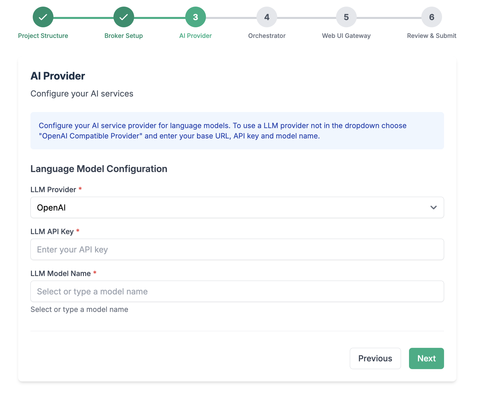

> aside positive
> The model of choice impact the performance of your results and system behaviour. A performative model is recommended for advanced use-cases


Configure your main orchestrator

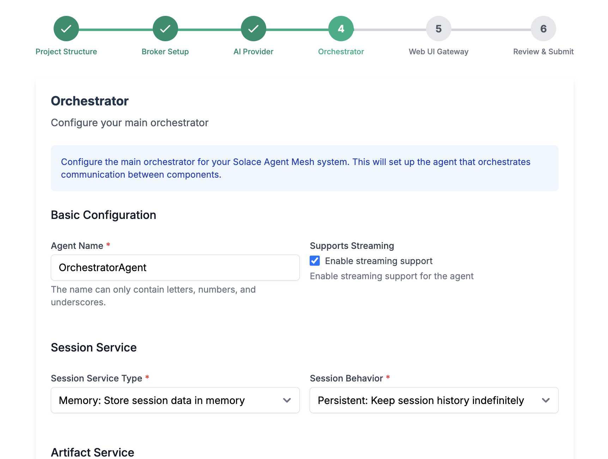

> aside positive
> Keep all the configuration parameters as default. You can explore the other options for configuring the orchestrator agent to see what you have available for fine tuning the behaviour


Configure the WebUI Gateway


> aside positive
> Note: Choose any Session Secret Key needed for the WebUI. Keep the remaining configurations as default. 

Review and Initialize the final configuration

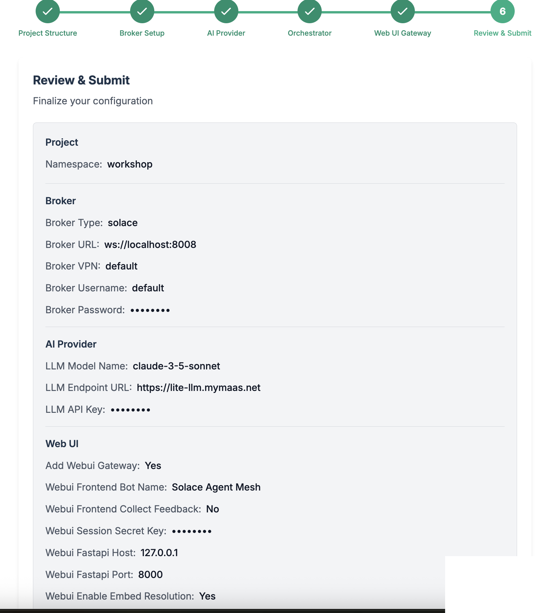

🎉 You have now successfully configured your Solace Agent Mesh environment! Now go back to terminal and continue with the next steps to run the Agent Mesh

## Running Solace Solace Agent Mesh
Duration: 0:05:00

After initializing your Solace Agent Mesh instance, you will find out the following files and directories has been created in your project folder

```bash
.
├── .env
├── .sam
├── configs
│   ├── agents
│   │   └── main_orchestrator.yaml
│   ├── gateways
│   │   └── webui.yaml
│   ├── logging_config.ini
│   └── shared_config.yaml
├── requirements.txt
└── src
    └── __init__.py
```

Here is a quick explanation on what this folder structure reflects: 

- `.env` - Contains environment variables used for configuration flexibility across different environments. Such variables include API keys, LLM endpoints, and any secret needed and accessed by the agent runtime. Note that when solace agent mesh runs, it injects the contents of this file to the agent runtime thread. 

- `.sam` - This directory contains framework-specific settings such as plugin configurations

- `config` - Houses all configuration YAML files for your SAM project, organized into several key components such as agents, gateways,logging settings, and common configuration settings shared across all agents and gateways (e.g. broker connection settings, model definitions, and service configurations)

> aside positive
> The shared configuration file employs YAML anchors (& and *) for referencing common elements throughout the configuration structure.


**Key Configuration Files**

`main_orchestrator.yaml`

This file configures the main orchestrator agent, which manages tasks and coordinates workflows between agents.

`webui.yaml`

This file configures the web user interface gateway, which provides a browser-based interface for interacting with the agent mesh.

**Configuration Management**

- Each configuration file defines one or more applications that can run independently
- The SAM framework supports agent applications, gateway applications, and plugin applications
- Configuration files are automatically generated by commands like `sam add agent`, `sam add gateway`, or `sam plugin add`
- You can run individual configuration files using sam run <config-file>


### Running the Solace Agent Mesh
Execute the following command to run Solace Agent Mesh

```
sam run
```

Access the WebUI Gateway through `http://127.0.0.1:8000/`


🚀 Voilà! You are up and running with the Solace Agent Mesh!

Now run the following prompt in the chat window

```
What are your capabilities?
```
and click the "Agent Workflow" icon


Explore the command flow


For the remaining of any prompts you execute to Solace Agent Mesh, you can always click this Agent Workflow icon to get a better understanding on what is happening

## Adding Agents 
Duration: 0:05:00


As mentioned earlier, Agents are specialized processing units built around ADK. They provide domain-specific knowledge and capabilities and can operate independently and be deployed separately.

In Solace Agent Mesh, Agents are configuration driven vial YAML files and there are multiple ways to develop an agent:
1. Using built-in templates,
1. Using the `sam add agent` cli command
1. Using the GUI interface `sam add agent --gui`
1. custom using Python

Lets add a simple agent that converts any document to markdown leveraging the Solace Agent Mesh built-in tools.

1. Stop your solace agent mesh instance if its already running
2. Create a new file under `configs/agents/` and name it `markitdown.yaml`
3. Add the following content

```yaml
log:
  stdout_log_level: INFO
  log_file_level: DEBUG # Changed from INFO to DEBUG to capture ADK INFO logs
  log_file: markitdown.log

# Shared SAM config
!include ../shared_config.yaml

apps:

# ---  Markitdown Agent ---
  - name: markitdown_agent_app
    app_base_path: .
    app_module: solace_agent_mesh.agent.sac.app
    broker:
      <<: *broker_connection

    # --- App Level Config ---
    app_config:
      namespace: ${NAMESPACE}
      supports_streaming: true
      agent_name: "MarkitdownAgent"
      display_name: "Markdown"
      model: *multimodal_model # Or *planning_model, choose as appropriate
      instruction: |
        The MarkitdownAgent has the following capability:
        * convert various file types (like PDF, DOCX, XLSX, HTML, CSV, PPTX, ZIP) to Markdown.
        Any files you get that might be useful should be saved using create_artifact.
        There is no need to provide a preview of the content in the response.

      # --- Tools Definition ---
      tools:
        - tool_type: builtin
          tool_name: "convert_file_to_markdown"
        - tool_type: builtin-group
          group_name: "artifact_management"

      session_service:
        type: "memory"
        default_behavior: "PERSISTENT" # Or "RUN_BASED"

      artifact_service:
        type: "filesystem"
        base_path: "/tmp/samv2"
        artifact_scope: namespace
      artifact_handling_mode: "reference"
      enable_embed_resolution: true
      enable_artifact_content_instruction: true

      # --- Agent Card Definition ---
      agent_card:
        description: "An agent that converts various file types (like PDF, DOCX, XLSX, HTML, CSV, PPTX, ZIP) to Markdown format."
        defaultInputModes: ["text", "file"] # Can take files as input
        defaultOutputModes: ["text", "file"] # Outputs markdown file
        skills:
        - id: "convert_file_to_markdown"
          name: "Markdown Converter"
          description: "Converts various file types to Markdown format."

      # --- Discovery & Communication ---
      agent_card_publishing: { interval_seconds: 10 }
      agent_discovery: { enabled: false }
      inter_agent_communication:
        allow_list: []
        request_timeout_seconds: 60
```
4. Run solace agent mesh `sam run`

> aside positive
> The `sam run` command will traverse through all the yaml configurations in your directory (agents and gateways) and pass them to the solace agent mesh. If you want to run an agent in isolation, you can run an instance of solace agent mesh with all of configurations except the agent of your choice `sam run -s configs/agents/markitdown.yaml` and in another terminal you can run `sam run configs/agents/markitdown.yaml` that runs that agent in isolation. You can do the same thing with all the yaml configuration files in separate terminals. 

5. Observe the agent in the WebGUI Gateway

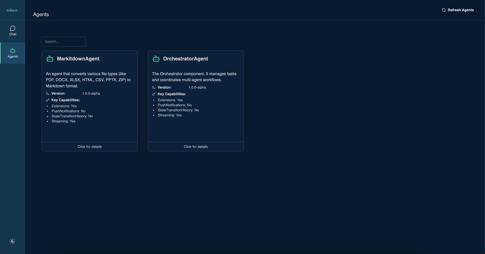

> aside positive
> Check out the [examples](https://github.com/SolaceLabs/solace-agent-mesh/tree/main/examples/agents) directory for other agent yaml configurations.


## Understanding the YAML configuration of agents
Duration: 0:05:00

The Solace Agent Mesh framework is controlled by YAML configuration files that define agents, gateways, and plugins, allowing for configuration-driven development without code changes.

Agent configuration files in Solace Agent Mesh are stored in the `configs/agents/` directory. Each agent has its own YAML file that defines its behavior, capabilities, and integration settings.

### Key Components of Agent YAML Files

A typical agent configuration YAML file includes these key sections:

1. **Basic Agent Information**
   - Name and description of the agent
   - Version information
   - Type of agent (e.g., assistant, orchestrator)

2. **Model Configuration (Note: Could be shared)**
   - LLM provider and model selection
   - Temperature and other model parameters
   - System prompt/instructions for the agent

3. **Security and Authorization**
   - Authentication methods (API key, OAuth2, etc.)
   - Role-based access control settings
   - Permission definitions

4. **Tools and Capabilities**
   - Available tools and functions
   - Tool parameters and configurations
   - Built-in tool groups

5. **Integration Settings**
   - Connections to external services (Jira, databases, etc.)
   - API endpoints and credentials
   - Connection parameters

6. **Event Handling**
   - Event triggers and handlers
   - Timeout settings
   - Recovery mechanisms

7. **Agent Card Definition**
   - Description of capabilities for other agents to discover
   - Input/output modes
   - Skills listing

### Example Agent Configuration

Here's an example of a basic agent configuration YAML file:

```yaml
log:
  stdout_log_level: INFO
  log_file_level: DEBUG # Changed from INFO to DEBUG to capture ADK INFO logs
  log_file: name-agent.log

# Shared config
!include ../shared_config.yaml

apps:
  - name: name-agent_app
    app_base_path: .
    app_module: solace_agent_mesh.agent.sac.app
    broker:
      <<: *broker_connection # References a broker connection defined in shared_config.yaml
  
  app_config:
    # Basic agent identity
    namespace: ${namespace}
    supports_streaming: true
    agent_name: "example-agent"
    display_name: "Example Agent"
    
    # LLM model configuration
    model: *general_model  # References a model defined in shared_config.yaml
    
    # Agent instructions (system prompt)
    instruction: |
      You are a helpful assistant specialized in answering questions about Solace Agent Mesh.
      Always provide accurate and concise information.
    
    # Tools configuration
    tools:
      - tool_type: python
        component_module: "example_agent.tools"
        component_base_path: .
        function_name: "search_documentation"
        tool_name: "search_docs"
        tool_config:
          search_depth: 3
      
      # Built-in artifact tools for file operations
      - tool_type: builtin-group
        group_name: "artifact_management"
    
    # Agent card definition (A2A specification)
    agent_card:
      description: "A helpful assistant for Solace Agent Mesh documentation"
      defaultInputModes: ["text"]
      defaultOutputModes: ["text"]
      skills:
        - id: "search_docs"
          name: "Search Documentation"
          description: "Searches through Solace Agent Mesh documentation"
```
### Agent Cards in the A2A Specification

Agent Cards are a critical component of the Agent-to-Agent (A2A) protocol specification. They serve as the "identity" and capability declaration for agents in a distributed system.

### What Are Agent Cards?

An Agent Card is a document (in JSON format) that describes an agent's:
- Identity (name, description, version)
- Capabilities (what the agent can do)
- Skills (specific functions or abilities)
- Service endpoint URL (how to reach the agent)
- Authentication requirements (how to authenticate)
- Interaction protocols (how to communicate)

Agent Cards enable agents to discover each other and understand how to interact appropriately. They are the foundation of the A2A (Agent-to-Agent) protocol that Solace Agent Mesh implements.

### Agent Card Structure

In the Solace Agent Mesh YAML configuration, the agent card is defined within the `agent_card` section of the agent's configuration file. Internally, this is translated to a JSON document that follows the A2A specification.

The agent card includes:

1. **Basic Metadata**
   - `description`: A human-readable description of the agent's purpose
   - `defaultInputModes`: Formats the agent accepts as input (e.g., "text", "image")
   - `defaultOutputModes`: Formats the agent produces as output

2. **Skills Section**
   - Lists the specific capabilities or services the agent offers
   - Each skill has an ID, name, and description
   - Skills are discoverable by other agents for delegation and collaboration

3. **Authentication Information** (optional)
   - Methods for authenticating with the agent
   - Required scopes or permissions

4. **Capabilities Declaration** (optional)
   - Special features the agent supports (streaming, attachments, etc.)
   - Extension capabilities beyond core A2A functionality

### Benefits of the YAML Configuration Approach

The YAML-based configuration approach in Solace Agent Mesh provides several key benefits:

1. **Configuration-driven:** Precise control over agent behavior, service integrations, and security settings without code changes
2. **Security-first approach:** Built-in authorization framework with fine-grained access control
3. **Resilient by nature:** Event-driven design creates responsive, self-healing interactions
4. **Standardized discovery:** A2A-compliant agent cards enable seamless agent integration and collaboration

This configuration approach is particularly valuable for building complex multi-agent systems where agents need to discover and collaborate with each other based on their respective capabilities and skills.


## Built-in tools
Duration: 0:07:00

Built-in tools in the Solace Agent Mesh are a comprehensive set of capabilities that enable agents to perform complex tasks, interact with various systems, and collaborate effectively within the mesh ecosystem. These tools extends the native capabilities offered by the [Agent Development Kit (ADK)](https://google.github.io/adk-docs/). This of these tool as native functionalities that agents have access to like "functions" instead of building these from scratch. 

The Solace Agent Mesh comes with a series of built-in tools natively to the platform. Each built-in tool name is defined in the `tools` section of the application configuration for the agent in the yaml config file as follows

```yaml
tools:
   - tool_type: builtin
     tool_name: "tool_name"
```
> aside positive
> Note that this is a developing open source framework and more built-in tools will be developed and introduced. Learn more about the available tools from the [Built-in Tool documentation](https://solacelabs.github.io/solace-agent-mesh/docs/documentation/user-guide/builtin-tools/)

**1. Artifact Management Tools**

Artifact management tools handle the creation, storage, and retrieval of content and data objects across the agent ecosystem. They ensure artifacts such as documents, code, or structured data can be versioned, shared, and persistently stored while also supporting format conversion for interoperability. These tools make it easier for agents to generate and reuse artifacts seamlessly.

**2. Data Analysis Tools**

Data analysis tools allow agents to process, transform, and analyze data from a variety of sources. They support statistical analysis, natural language processing, and visualization generation, enabling agents to extract insights from both structured and unstructured data. With built-in query functions, these tools can also handle natural language queries against different data stores.

**3. Web Tools**

Web tools empower agents to interact directly with web-based resources and services. They support sending HTTP requests, retrieving and parsing content, and integrating with APIs while managing authentication methods like OAuth or API keys. In permitted cases, they also enable web scraping and structured response handling.

**4. Peer Agent Delegation Tools**

Peer agent delegation tools make collaboration among agents more efficient by supporting the distribution of tasks across specialized agents. They allow context to be shared, results to be aggregated, and coordination strategies to be applied, whether sequential, parallel, or conditional. These tools also enable agents to discover expertise and provide feedback to one another.

**5. Developer Tools**

Developer tools help streamline the development, deployment, and maintenance of the agent mesh. They include command-line utilities for management, debugging interfaces for real-time monitoring, and configuration management systems for precise control. Additionally, observability and testing frameworks provide insights into system health and validation of agent performance.

**6. System Integration Tools**

System integration tools connect agents with external backend systems and enterprise platforms. They provide connectors to databases, event streams, and message queues while also allowing controlled file system access. These tools extend the mesh’s capabilities by integrating AI models and external enterprise applications into agent workflows.


Lets take an example for a `web-request` agent

```yaml
- name: web_agent_app
    app_base_path: .
    app_module: solace_agent_mesh.agent.sac.app
    broker:
      <<: *broker_connection

    app_config:
      namespace: ${NAMESPACE}
      supports_streaming: true
      agent_name: "WebAgent"
      display_name: "Web Content"
      model: *planning_model # Or another appropriate model from shared_config.yaml
      instruction: |
        You are an agent that can fetch content from web URLs using the 'web_request' tool.
        You can make various types of HTTP requests (GET, POST, etc.) and include custom headers or a body.
        The tool will return the fetched content (HTML converted to Markdown, other text types as is, or raw binary data).
        You will then need to process this content based on the user's request.
        Always save useful fetched content as an artifact.

      tools:
        - tool_type: builtin
          tool_name: "web_request"
        - tool_type: builtin-group
          group_name: "artifact_management"
```

This yaml configuration of a Web Agent uses two types of tools: a built-in tool `web_request` that handles web requests and a group of built-in tools `artifact_management` that handles artifact access 

## Plugins Ecosystem
Duration: 0:10:00


Plugins serve as the backbone of the Solace Agent Mesh extensible architecture, providing a structured way to package, distribute, and incorporate new features into any SAM deployment. They are modular Python packages that extend the agent mesh's capabilities through specialized components that integrate seamlessly with the A2A protocol.

To spin up the list of the core plugins offered by the Solace Agent Mesh, execute the following

```
sam plugin catalog
```
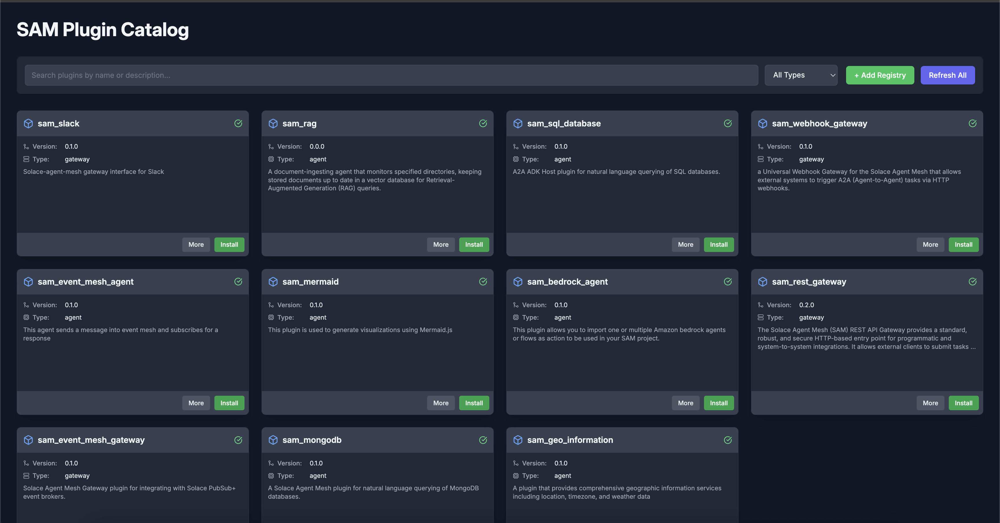

### Types of plugins
Solace Agent Mesh supports three primary categories of plugins, each serving different purposes within the ecosystem:

**Agent Plugins**
These contain specialized agents with domain-specific capabilities. They extend the system's ability to perform specific tasks or interact with particular data sources or services. For example, an agent plugin might specialize in processing financial data or analyzing medical imagery.

**Gateway Plugins**
These provide new interface types for external system integration, enabling SAM to connect with various user interfaces, APIs, or communication channels. Gateway plugins might add support for channels like Slack, Microsoft Teams, or custom web interfaces.

**Custom Plugins**
These implement specialized integrations that don't fit neatly into the agent or gateway categories. Examples include connectors for specific enterprise systems, data transformation services, or security extensions.

### Where to get plugins?

The Solace Agent Mesh ecosystem encompasses both official and community-developed plugins:

#### Official Core Plugins
These are developed and maintained by the Solace team, providing essential capabilities for common use cases. The official plugins are available in the Solace repository at [https://github.com/SolaceLabs/solace-agent-mesh-core-plugins](https://github.com/SolaceLabs/solace-agent-mesh-core-plugins).

#### Community Plugins
Solace Agent Mesh plugins ecosystem also encourages community contributions through the plugin system. These plugins extend the platform in numerous ways and can be discovered through the same plugin catalog as official plugins. to learn more about the existing plugins, check the github repository [https://github.com/solacecommunity/solace-agent-mesh-plugins](https://github.com/solacecommunity/solace-agent-mesh-plugins)

> aside positive
> Community plugins can be seamlessly integrated alongside official plugins, providing a unified experience while expanding the capabilities of your Solace Agent Mesh deployment.

### Adding custom plugins repository to the catalog

1. Click on the `Add Registry` button


2. Input the information in the dialog


   - Registry URL: `https://github.com/solacecommunity/solace-agent-mesh-plugins`
   - Registry Name: Community

3. Install the plugin of choice


To learn more about plugins, the differences between plugins and agents, and how to create your first plugin check out the Solace Agent Mesh [Plugins documentation](https://solacelabs.github.io/solace-agent-mesh/docs/documentation/concepts/plugins)

## Adding MCP Agents
Duration: 0:05:00

As mentioned earlier, the Solace Agent Mesh is an agent agnostic framework. Agents are YAML configuration driven and can be authored using 

In this step, we are going to add an MCP agent using the graphical user interface.

From your terminal instance, execute this command from your terminal

```
sam add agent --gui
```

Let's go ahead and add an MCP agent that executes filesystem operations such as read/write, create files, get list of files, and searching directories. Learn more about this MCP agent from the [Filesystem MCP Server](https://github.com/modelcontextprotocol/servers/tree/main/src/filesystem) found in the official list of open source MCP servers

Fill in the following information with the following instructions
```
You can interact with the local filesystem using MCP tools. Use the available tools to read, write, and manage files as requested.
```


Select the service. Note you can leave everything default here
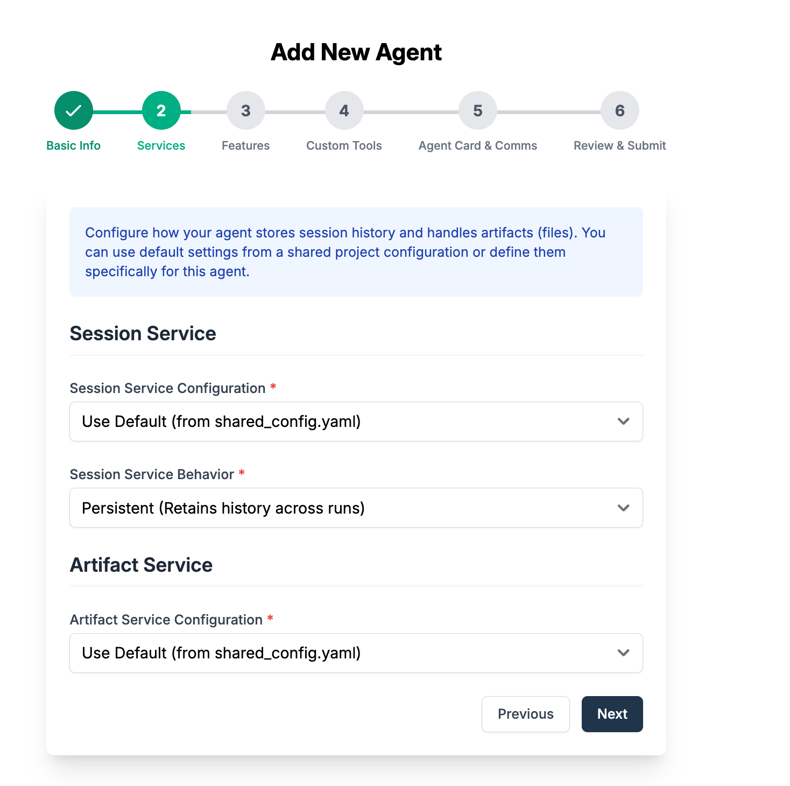

Features is a list of A2A specific features that can extend the functionalities of your agent (in this example an MCP agent) to expose A2A features to it. Keep everything default here
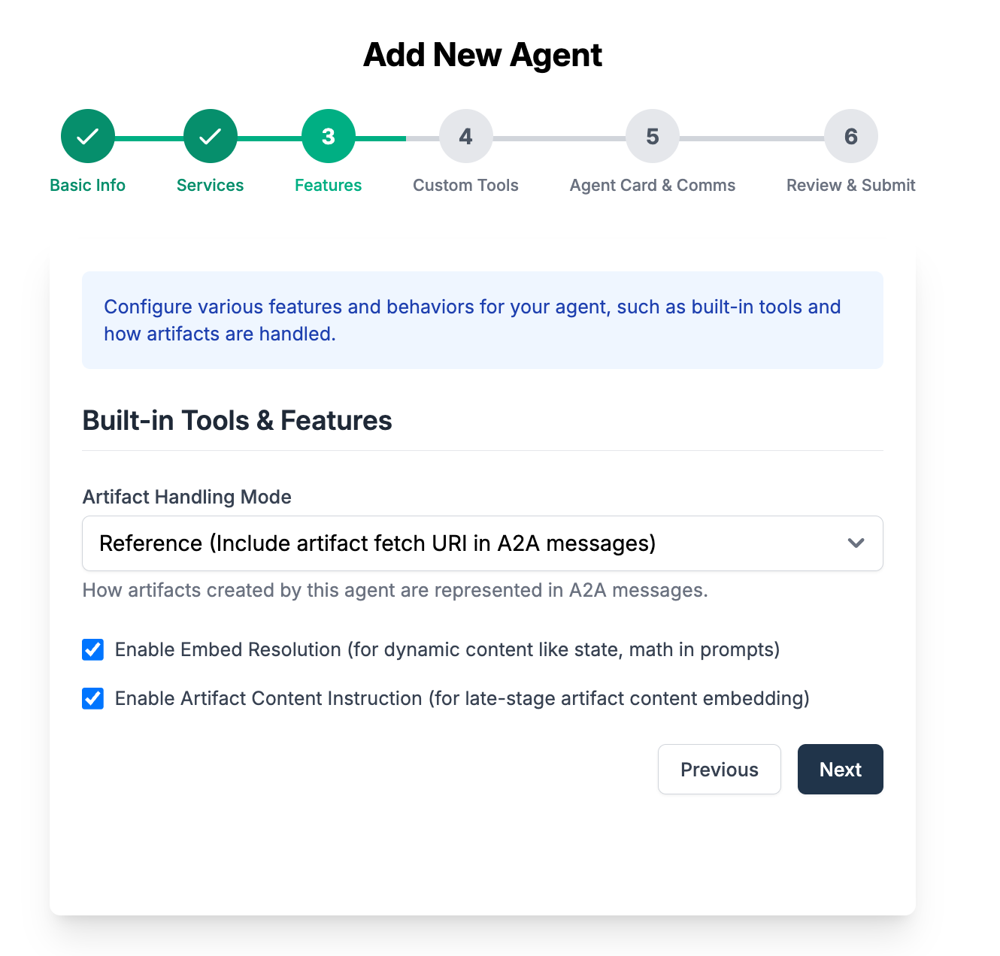


In this step, you will have to define the list of tools and skills this agent has. As mentioned in a previous step, tools could be built-in from the Solace Agent Mesh or you can specify a list of tools that are exposed from an MCP serve. 
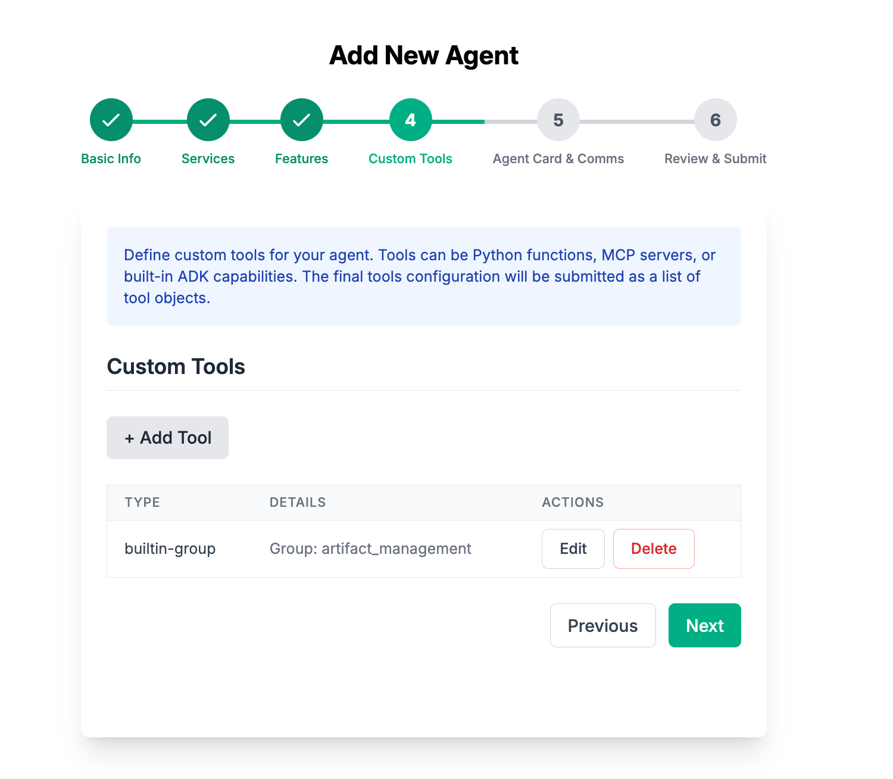

Go ahead and click the `Add Tool` button
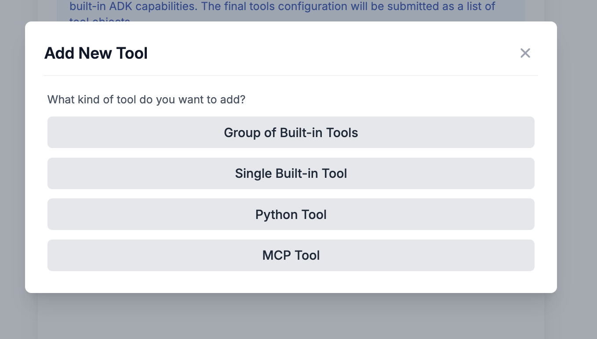

You can see here there a list of different kind of tools to add. Go ahead and click on the MCP Tool 


Under the Connection Parameters, add the following 

```JSON
{
  "type": "stdio",
  "command": "npx",
  "args": ["-y", "@modelcontextprotocol/server-filesystem", "/tmp/samv2"]
}

```

> aside positive
> In this example, we are using a stdio connection as the `type` to connect to an MCP server running as a local process. There are different types of connections including SSE (server sent events) to a remote MCP server, docker for a containerized MCP server, and other types as this connection evolves

> aside positive
> Note: you can replace `/tmp/samv2` with any directory of your choice

Click the `Add Tool`. Notice how this new agent now has two types of custom tools
1. Artifact Management: This is a group of Solace Agent Mesh built-in tools that extends the capabilities of the custom agent
1. MCP: All the tools that are defined in the MCP server exposed as custom tools for the agent

Click `Next`

You are then prompted with the Agent Card dialog. 
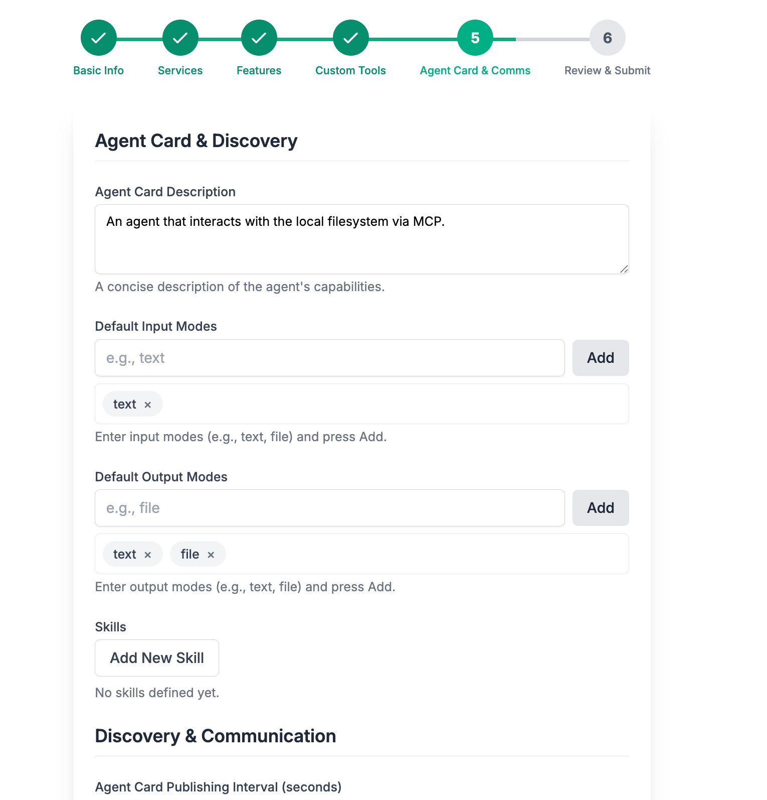

Add the following Agent Card Description

```
An agent that interacts with the local filesystem via MCP.
```

Leave everything else as the default. Click `Next`.

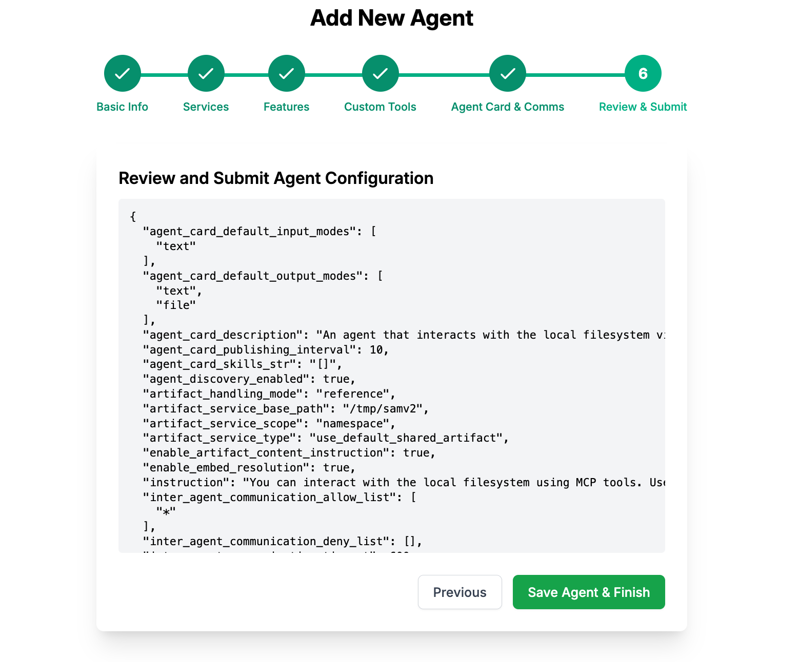

🎉 Click `Save Agent & Finish` and you're done! You now have a custom MCP Agent configured.

This process created a yaml configuration file under `configs/agents/file_system_agent.yaml`. I want to point to your attention to this section of the configuration

```yaml
tools: 
   - group_name: artifact_management
      tool_type: builtin-group
   - connection_params:
      args:
      - -y
      - '@modelcontextprotocol/server-filesystem'
      - /tmp/samv2
      command: npx
      timeout: 30
      type: stdio
      tool_type: mcp
```
You can see here that this agent has two types of tools: the built-in tools and an MCP configuration. 

The full yaml configuration for the agent should look like this

```yaml
# Solace Agent Mesh Agent Configuration

log:
  stdout_log_level: INFO
  log_file_level: DEBUG
  log_file: a2a_agent.log

!include ../shared_config.yaml

apps:
  - name: "FileSystem__app"
    app_base_path: .
    app_module: solace_agent_mesh.agent.sac.app
    broker:
      <<: *broker_connection

    app_config:
      namespace: "${NAMESPACE}"
      supports_streaming: true
      agent_name: "FileSystem"
      display_name: "File System Agent"
      model: *general_model 

      instruction: |
        You can interact with the local filesystem using MCP tools. Use the available tools to read, write, and manage files as requested.
      
      tools: 
        - group_name: artifact_management
          tool_type: builtin-group
        - connection_params:
            args:
            - -y
            - '@modelcontextprotocol/server-filesystem'
            - /tmp/samv2
            command: npx
            timeout: 30
            type: stdio
          tool_type: mcp

      session_service: 
        type: "sql"
        default_behavior: "PERSISTENT"
        database_url: "${FILE_SYSTEM_DATABASE_URL}"
      artifact_service: *default_artifact_service
      
      artifact_handling_mode: "reference"
      enable_embed_resolution: true
      enable_artifact_content_instruction: true
      data_tools_config: *default_data_tools_config

      # Agent Card Definition
      agent_card:
        description: |
          An agent that interacts with the local filesystem via MCP.
        defaultInputModes: [text] 
        defaultOutputModes: [text, file] 
        skills: []
      
      # Discovery & Communication
      agent_card_publishing: 
        interval_seconds: 10
      agent_discovery: 
        enabled: true
      inter_agent_communication:
        allow_list: ["*"] 
        deny_list: [] 
        request_timeout_seconds: 600
```

Now go ahead and run an instance of the solace agent mesh from your terminal in your root project directory
```
sam run
```
Navigate to the Agents tab and see the new agent in the list

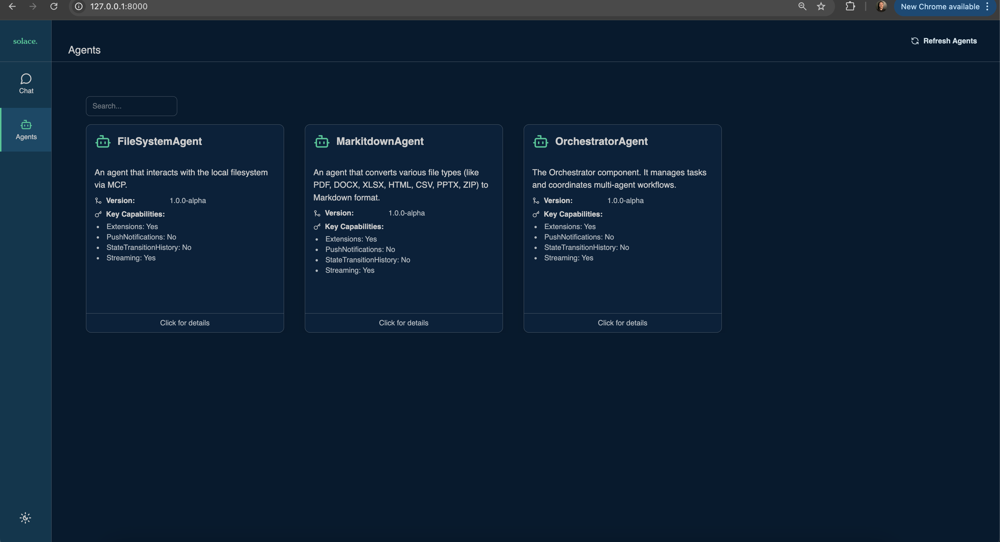

Now that you have the File Agent up and running, you can run any of the following prompts to see it in action

```
"List the files in the directory"
"Create a simple text file with some content"
"Read the contents of test.txt"
```

To learn more about MCP integrations with the Solace Agent mesh, refer to the [MCP Integration](https://solacelabs.github.io/solace-agent-mesh/docs/documentation/tutorials/mcp-integration) section in the documentation


## Next Steps
Duration: 0:05:00

Now that you have a foundational understanding of Solace Agent Mesh and have deployed your first agent ecosystem, here are some recommended next steps to continue your journey:

### 📚 Explore the Documentation
Visit the [Solace Agent Mesh Documentation](https://solacelabs.github.io/solace-agent-mesh/docs/documentation/getting-started/introduction/) for comprehensive guides, API references, and advanced concepts. The documentation provides in-depth information on:
- Creating custom agents with specific capabilities
- Understanding the A2A protocol in detail
- Advanced deployment patterns

### 🤝 Join the Community
- Star and watch the [Solace Agent Mesh Repository](https://github.com/SolaceLabs/solace-agent-mesh) to stay updated with the latest developments
- Explore community plugins in the [Solace Community Plugins Repository](https://github.com/solacecommunity/solace-agent-mesh-plugins)
- Join the [Solace Community Forum](https://solace.community/) to connect with other developers and get support

### 🚀 Enhance Your Deployment
- Add more specialized agents to your mesh using `sam add agent`
- Try different LLM providers to compare performance and capabilities
- Create agent workflows that solve specific business problems in your organization
- Integrate with your existing systems and data sources

### 🧩 Develop Custom Plugins
Consider creating your own plugins to extend the functionality of Solace Agent Mesh:
1. Use the `sam plugin create` command to scaffold a new plugin
2. Follow the plugin development guide in the documentation
3. Share your plugin with the community through the [Solace Community Plugins Repository](https://github.com/solacecommunity/solace-agent-mesh-plugins)

### 📰 Stay Updated
- Follow the [Solace Blog](https://solace.com/blog) for articles about Agent Mesh and event-driven architectures
- Subscribe to webinars and events featuring Solace Agent Mesh implementations
- Check out technical deep dives and tutorials on the Solace YouTube channel

### 🏭 Production Deployment
As you move towards production use cases:
- Implement proper security measures with authentication and authorization
- Set up monitoring and observability for your agent mesh
- Consider scaling strategies for high-traffic environments
- Deploy with containerization using Docker and Kubernetes

### 📺 Check out our youtube playlists!

<video id="_4IdRPBM2y8"></video>
<video id="Tpy_8RVLPNU"></video>

> aside positive
> Remember that Solace Agent Mesh is an evolving framework with active development and community contributions. Regular updates bring new features, optimizations, and capabilities to enhance your AI agent ecosystem.

## Takeaways
Duration: 0:07:00

Throughout this codelab, you've gained valuable insights into Solace Agent Mesh and its capabilities. Here are the key takeaways to remember:

### Architectural Benefits
- **Event-Driven Foundation**: Solace Agent Mesh leverages event-driven architecture to create resilient, scalable agent communication patterns based on the Solace Event Broker.
- **Standardized Protocol**: The A2A (Agent-to-Agent) protocol provides a common language for agents to communicate, regardless of their implementation or location.
- **Decoupled Components**: The mesh architecture allows components to be developed, deployed, and scaled independently, reducing system complexity.

### Development Advantages
- **Configuration-Driven**: Most agent capabilities can be defined through YAML configuration without requiring code changes.
- **Plugin Ecosystem**: The extensible plugin architecture allows for rapid capability expansion through both official and community plugins from the [Solace Agent Mesh Plugins Repository](https://github.com/SolaceLabs/solace-agent-mesh-core-plugins).
- **Multi-Provider Support**: Freedom to use different LLM providers including OpenAI, Anthropic, Google, and others based on your specific needs.

### Integration Capabilities
- **Event Mesh Connectivity**: Native integration with Solace PubSub+ Event Broker provides enterprise-grade messaging infrastructure.
- **Multi-Protocol Gateways**: Support for multiple communication protocols allows for flexible integration with existing systems.
- **MCP Integration**: Model Context Protocol support enables connection to various specialized tools and capabilities.

### Business Value
- **Reduced Integration Complexity**: The standardized communication layer drastically reduces the effort needed to connect AI systems with enterprise data sources.
- **Specialized Agent Collaboration**: Domain-specific agents can work together to solve complex problems that would be difficult for a single agent to address.
- **Scalable Architecture**: The event-driven foundation allows the system to scale horizontally as demand increases.

### Getting Support and Resources
- The [Solace Agent Mesh GitHub repository](https://github.com/SolaceLabs/solace-agent-mesh) contains the core framework code, examples, and documentation.
- The [Solace Community Plugins Repository](https://github.com/solacecommunity/solace-agent-mesh-plugins) offers extensibility through community-developed plugins.
- The [Solace Blog](https://solace.com/blog) regularly features articles about Agent Mesh use cases and best practices.
- The comprehensive [Solace Agent Mesh documentation](https://solacelabs.github.io/solace-agent-mesh/docs/documentation/getting-started/introduction/) provides detailed guides and reference materials.

Solace Agent Mesh represents a significant advancement in building enterprise-grade agentic systems that can collaborate effectively at scale. By combining the power of event-driven architecture with modern AI capabilities, it provides a robust foundation for building the next generation of intelligent applications.

As the ecosystem continues to evolve, stay connected with the community through the repositories and forums to leverage the collective knowledge and contribute to this growing platform.

Thanks for participating in this codelab! Let us know what you thought in the [Solace Community Forum](https://solace.community/)! If you found any issues along the way we'd appreciate it if you'd raise them by clicking the Report a mistake button at the bottom left of this codelab.
